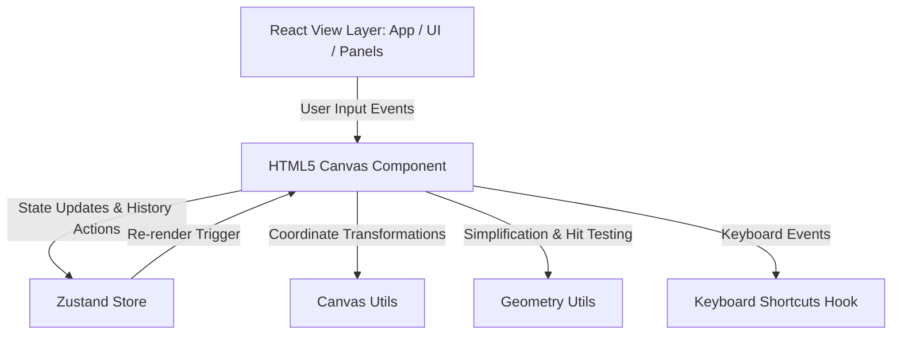
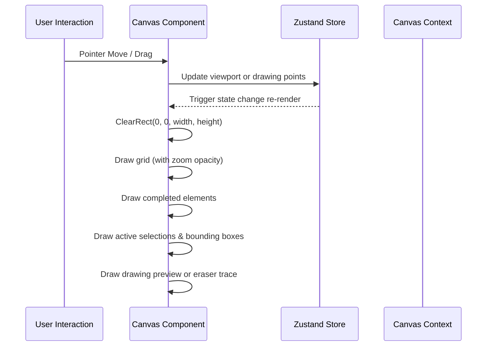
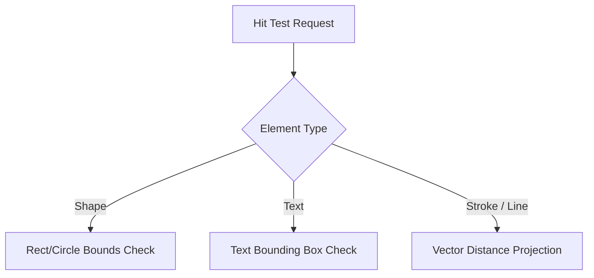

# Stroke Whiteboard Application: Technical Architecture & Interview Guide

This document provides an in-depth, interview-focused technical breakdown of **Stroke**, a premium whiteboard application built with React, TypeScript, Zustand, and HTML5 Canvas. It details the math, algorithms, state paradigms, and performance decisions required to build a production-grade interactive canvas from scratch.

---

## 1. System Architecture & High-Level Design

Building an interactive canvas requires balancing high-frequency user interactions (like cursor tracking and drawing) with structured state updates. In *Stroke*, the system architecture is structured with a clear separation of concerns:



### Key Modules:
1. **React UI Components (`App.tsx`, `Toolbar.tsx`, `ToolPalette.tsx`, `ColorPalette.tsx`)**: High-level declarative layout, using Tailwind CSS and Framer Motion for responsive design, layout panels, and glassmorphism micro-animations.
2. **State Store (`useStore.ts`)**: Global state container powered by Zustand. It manages elements, selection lists, camera viewports, layout metrics, drawing attributes, and undo/redo stacks.
3. **Canvas Engine (`Canvas.tsx`)**: The active interface bridging React and the HTML5 Canvas API. It coordinates mouse/touch/pointer gestures, maintains input overlays, and drives the drawing render loop.
4. **Drawing Utils (`canvas.ts`)**: Pure rendering functions that accept canvas contexts and elements, applying matrix translations to draw specific vector entities.
5. **Geometry Utils (`geometry.ts`)**: Low-level math functions containing hit-testing calculations, vector projections, and path simplification algorithms.
6. **Input Hook (`useKeyboardShortcuts.ts`)**: Manages document-wide keyboard listener systems to execute action hotkeys while bypassing inputs when text elements are focused.

---

## 2. The Coordinate Transformation Engine (Virtual Canvas Space)

In web development, mouse events report coordinates relative to the screen or viewport. However, in an infinite pan-and-zoom whiteboard, elements must exist in a **universal virtual coordinate space**.

### Coordinate Systems:
- **Screen Space ($S$)**: The coordinate grid of the browser's visible canvas element, where $(0,0)$ is the top-left corner of the canvas on the screen.
- **Canvas/Virtual Space ($V$)**: The infinite coordinate space where drawings live. An element placed at $(100, 100)$ in Virtual Space remains at that coordinate even if the user zooms out or pans away.

The connection between Screen Space and Canvas Space is defined by the **Viewport State**:
- **Pan Offsets ($v_x, v_y$)**: The offset of the virtual origin relative to the screen origin.
- **Zoom Scale ($z$)**: The magnification factor (e.g., $1.0 = 100\%$, $0.5 = 50\%$).

### Mathematical Formulations

#### 1. Mapping Screen Point to Virtual Canvas Coordinate
To find where on the virtual canvas a user clicked, we must invert the translation and zoom transformations:
$$X_{\text{canvas}} = \frac{X_{\text{screen}} - v_x}{z}$$
$$Y_{\text{canvas}} = \frac{Y_{\text{screen}} - v_y}{z}$$

In [canvas.ts](file:///c:/Users/renit/Desktop/kowding_is_Cool/stroke/src/utils/canvas.ts#L4-L9):
```typescript
export function screenToCanvas(point: Point, viewport: Viewport): Point {
    return {
        x: (point.x - viewport.x) / viewport.zoom,
        y: (point.y - viewport.y) / viewport.zoom,
    };
}
```

#### 2. Mapping Virtual Canvas Coordinate to Screen Point
To draw screen-space overlays (like the text editing overlay) at the correct position, we apply the forward transformation:
$$X_{\text{screen}} = X_{\text{canvas}} \cdot z + v_x$$
$$Y_{\text{screen}} = Y_{\text{canvas}} \cdot z + v_y$$

In [canvas.ts](file:///c:/Users/renit/Desktop/kowding_is_Cool/stroke/src/utils/canvas.ts#L11-L16):
```typescript
export function canvasToScreen(point: Point, viewport: Viewport): Point {
    return {
        x: point.x * viewport.zoom + viewport.x,
        y: point.y * viewport.zoom + viewport.y,
    };
}
```

#### 3. Zoom-to-Mouse Focus Math
When a user zooms using the scroll wheel, they expect the point under their mouse cursor to remain stationary. The math shifts the viewport offsets ($v_x, v_y$) to align with the new scale:

Let $P_{\text{mouse}}$ be the screen coordinate of the cursor, $z_{\text{old}}$ be the current zoom, and $z_{\text{new}}$ be the target zoom.
$$s = \frac{z_{\text{new}}}{z_{\text{old}}}$$
$$v_{x,\text{new}} = P_{\text{mouse},x} - (P_{\text{mouse},x} - v_{x,\text{old}}) \cdot s$$
$$v_{y,\text{new}} = P_{\text{mouse},y} - (P_{\text{mouse},y} - v_{y,\text{old}}) \cdot s$$

In [Canvas.tsx](file:///c:/Users/renit/Desktop/kowding_is_Cool/stroke/src/components/Canvas.tsx#L813-L837):
```typescript
const scale = newZoom / zoom;
const newX = mouseX - (mouseX - viewport.x) * scale;
const newY = mouseY - (mouseY - viewport.y) * scale;
```

---

## 3. High-Performance Canvas Rendering

HTML5 Canvas uses an immediate-mode rendering model. Every frame, the entire canvas is cleared and redrawn. Optimizing this loop is critical for maintaining a smooth 60fps refresh rate.



### Context Transforms & Rotations
To draw an element with an arbitrary rotation, we avoid recalculating all geometric vertices. Instead, we transform the rendering context's coordinate matrix, draw the element at its local coordinate base, and restore the canvas matrix.

In [canvas.ts](file:///c:/Users/renit/Desktop/kowding_is_Cool/stroke/src/utils/canvas.ts#L70-L83):
```typescript
ctx.save();
// 1. Apply viewport pan and zoom
ctx.translate(viewport.x, viewport.y);
ctx.scale(viewport.zoom, viewport.zoom);

// 2. Apply element rotation
if (element.rotation !== 0) {
    const centerX = element.x + (element.type === 'shape' ? (element as Shape).width / 2 : 0);
    const centerY = element.y + (element.type === 'shape' ? (element as Shape).height / 2 : 0);
    
    ctx.translate(centerX, centerY);
    ctx.rotate((element.rotation * Math.PI) / 180);
    ctx.translate(-centerX, -centerY);
}
// 3. Draw local shape (relative to its own x, y)
// 4. Restore original context state
ctx.restore();
```

---

## 4. Advanced Drawing Algorithms & Path Math

Stroke implements two key algorithms to convert raw pointer coordinates into clean vector paths:

### 1. Douglas-Peucker Simplification Algorithm
When a user moves their mouse/stylus quickly, the browser generates hundreds of coordinate events. Storing all these raw points creates massive JSON payloads, consumes excessive memory, and degrades rendering performance.

The **Douglas-Peucker algorithm** simplifies a curve composed of line segments by reducing points while keeping the maximum perpendicular distance within a specified tolerance threshold ($\epsilon$).

```
                      [P_max] (Distance > epsilon)
                     /       \
                    /         \
                   /           \
  [P_start]-------/-------------\-------[P_end]
```

**How it works (Recursive):**
1. Draw a line directly from the first point to the last point of the path.
2. Find the point along the curve that is furthest from this line segment (perpendicular distance).
3. If this maximum distance ($d_{\text{max}}$) is less than the threshold $\epsilon$, discard all intermediate points. The curve is approximated by the straight line.
4. If $d_{\text{max}} \ge \epsilon$, keep the furthest point, split the path in two at its index, and recursively apply the algorithm to both halves.

In [geometry.ts](file:///c:/Users/renit/Desktop/kowding_is_Cool/stroke/src/utils/geometry.ts#L77-L128):
```typescript
export function simplifyStroke(points: Point[], tolerance: number = 2): Point[] {
    if (points.length <= 2) return points;

    function perpDistance(point: Point, lineStart: Point, lineEnd: Point): number {
        const dx = lineEnd.x - lineStart.x;
        const dy = lineEnd.y - lineStart.y;
        if (dx === 0 && dy === 0) return distance(point, lineStart);
        
        // Project point onto line segment
        const t = ((point.x - lineStart.x) * dx + (point.y - lineStart.y) * dy) / (dx * dx + dy * dy);
        if (t < 0) return distance(point, lineStart);
        if (t > 1) return distance(point, lineEnd);
        
        return distance(point, { x: lineStart.x + t * dx, y: lineStart.y + t * dy });
    }

    function douglasPeucker(pts: Point[], epsilon: number): Point[] {
        let maxDist = 0;
        let index = 0;
        const end = pts.length - 1;

        for (let i = 1; i < end; i++) {
            const dist = perpDistance(pts[i], pts[0], pts[end]);
            if (dist > maxDist) {
                maxDist = dist;
                index = i;
            }
        }

        if (maxDist > epsilon) {
            const left = douglasPeucker(pts.slice(0, index + 1), epsilon);
            const right = douglasPeucker(pts.slice(index), epsilon);
            return [...left.slice(0, -1), ...right];
        }
        return [pts[0], pts[end]];
    }

    return douglasPeucker(points, tolerance);
}
```

### 2. Quadratic Bezier Curve Path Smoothing
Connecting points with straight lines creates jagged corners. To produce natural, organic strokes, Stroke calculates the **midpoints between consecutive coordinates** and uses them as control anchors for **Quadratic Bezier Curves (`Q` commands in SVG paths)**.

```
       [P1] (Control Point)
       /  \
     /      \
  [Mid0]----[Mid1]
  (Start)   (End)
```

For every point $P_i$ along the path:
1. Calculate the midpoint: $M_i = \frac{P_i + P_{i+1}}{2}$.
2. Draw a quadratic curve with start point $M_{i-1}$, control point $P_i$, and endpoint $M_i$.

In [geometry.ts](file:///c:/Users/renit/Desktop/kowding_is_Cool/stroke/src/utils/geometry.ts#L130-L149):
```typescript
export function getSmoothPath(points: Point[]): string {
    if (points.length === 0) return '';
    if (points.length === 1) return `M ${points[0].x} ${points[0].y}`;

    let path = `M ${points[0].x} ${points[0].y}`;

    for (let i = 1; i < points.length - 2; i++) {
        // Calculate midpoint between current point and next point
        const xc = (points[i].x + points[i + 1].x) / 2;
        const yc = (points[i].y + points[i + 1].y) / 2;
        // Draw curve to midpoint using points[i] as the control point
        path += ` Q ${points[i].x} ${points[i].y} ${xc} ${yc}`;
    }

    // Connect the last two points
    if (points.length > 1) {
        const lastPoint = points[points.length - 1];
        const secondLastPoint = points[points.length - 2];
        path += ` Q ${secondLastPoint.x} ${secondLastPoint.y} ${lastPoint.x} ${lastPoint.y}`;
    }

    return path;
}
```

### 3. Arrowhead Rotations & Trigonometry
To draw arrowheads at the ends of a line segment, we must calculate the line's angle of inclination relative to the horizontal axis:
$$\theta = \operatorname{atan2}(\Delta y, \Delta x)$$
We then translate the context matrix to the target coordinate point, rotate it by the angle $\theta$, and draw a simple triangular shape.

In [canvas.ts](file:///c:/Users/renit/Desktop/kowding_is_Cool/stroke/src/utils/canvas.ts#L265-L282):
```typescript
function drawArrowhead(ctx: CanvasRenderingContext2D, x: number, y: number, angle: number) {
    const headLength = 12;
    const headWidth = 8;

    ctx.save();
    ctx.translate(x, y);
    ctx.rotate(angle);

    ctx.beginPath();
    ctx.moveTo(0, 0);
    ctx.lineTo(-headLength, -headWidth / 2);
    ctx.lineTo(-headLength, headWidth / 2);
    ctx.closePath();
    ctx.fill();

    ctx.restore();
}
```

---

## 5. Collision Detection & Interactive Hit Testing

To select or erase elements, the canvas needs to determine if a screen click falls within an element's boundaries.



### 1. Text & Bounding Box Overlap
For shape elements (rectangles, circles, ellipses, diamonds), hit testing checks if the pointer is within their rectangular bounding box. Text hit testing works similarly, but we use a temporary canvas instance to measure the string's actual render width based on its font styles.

In [Canvas.tsx](file:///c:/Users/renit/Desktop/kowding_is_Cool/stroke/src/components/Canvas.tsx#L770-L789):
```typescript
const canvas = document.createElement('canvas');
const ctx = canvas.getContext('2d');
if (ctx) {
    ctx.font = `${text.fontWeight || 400} ${text.fontSize}px Inter, sans-serif`;
    const metrics = ctx.measureText(text.text);
    const textWidth = metrics.width;
    const textHeight = text.fontSize * 1.2;

    if (
        point.x >= text.x &&
        point.x <= text.x + textWidth &&
        point.y >= text.y - textHeight / 2 &&
        point.y <= text.y + textHeight / 2
    ) {
        return element;
    }
}
```

### 2. Distance to Line Segments (Freehand Strokes & Arrows)
A freehand drawing has no width or height properties; it is defined by an array of vertices. To hit-test a stroke, we calculate the perpendicular distance from the cursor point $P_{\text{click}}$ to each individual line segment $S_i = (P_a, P_b)$ that makes up the stroke.

```
                  [P_click]
                     |
                     | (Distance d)
                     |
  [P_a]--------------*--------------[P_b]
                  (Proj)
```

**Mathematical Formula:**
For a segment from $P_a$ to $P_b$:
1. Calculate the segment vector $\vec{V} = P_b - P_a$.
2. Project $P_{\text{click}} - P_a$ onto $\vec{V}$, and clamp the projection parameter $t$ to $[0, 1]$ to ensure the point falls on the segment:
   $$t = \max\left(0, \min\left(1, \frac{(P_{\text{click}} - P_a) \cdot \vec{V}}{\|\vec{V}\|^2}\right)\right)$$
3. The nearest projected point on the segment is:
   $$P_{\text{proj}} = P_a + t \cdot \vec{V}$$
4. Calculate the Euclidean distance between $P_{\text{click}}$ and $P_{\text{proj}}$. If this distance is less than the stroke's width (plus an input padding tolerance), a collision is detected.

In [Canvas.tsx](file:///c:/Users/renit/Desktop/kowding_is_Cool/stroke/src/components/Canvas.tsx#L705-L729):
```typescript
const distanceToLineSegment = (point: Point, p1: Point, p2: Point): number => {
    const dx = p2.x - p1.x;
    const dy = p2.y - p1.y;
    const lengthSquared = dx * dx + dy * dy;

    if (lengthSquared === 0) return distance(point, p1);

    let t = ((point.x - p1.x) * dx + (point.y - p1.y) * dy) / lengthSquared;
    t = Math.max(0, Math.min(1, t)); // Clamp to segment length

    const closestX = p1.x + t * dx;
    const closestY = p1.y + t * dy;

    const distX = point.x - closestX;
    const distY = point.y - closestY;
    return Math.sqrt(distX * distX + distY * distY);
};
```

---

## 6. Advanced State Management & Architecture Patterns

### 1. Global State with Zustand
Zustand is used over React Context because it uses a **publisher-subscriber model** that avoids unnecessary re-renders. 

In a traditional Context implementation, updating pointer coordinates during a drag event triggers a complete re-render of the parent component tree. With Zustand, components subscribe only to specific slices of state. For instance, the Toolbar only re-renders when history state or themes change, keeping canvas interactions isolated and fast.

### 2. Command Pattern for Undo/Redo History
To implement a robust Undo/Redo stack, Stroke uses the **Command Pattern** by storing state snapshots.

```
Actions: Add / Delete / Edit
   |
   +---> Write snapshot of elements list to `past` stack.
   |
   +---> Clear `future` stack (break redo branch).
```

In [useStore.ts](file:///c:/Users/renit/Desktop/kowding_is_Cool/stroke/src/store/useStore.ts#L243-L277):
- **Undo Operation**: Pop the last state snapshot from the `past` array, set it as the active `elements` list, and push the current state to the `future` stack.
- **Redo Operation**: Pop the first state snapshot from the `future` array, set it as the active `elements` list, and push the current state to the `past` stack.

```typescript
undo: () => {
    set((state) => {
        if (state.history.past.length === 0) return state;

        const previous = state.history.past[state.history.past.length - 1];
        const newPast = state.history.past.slice(0, -1);

        return {
            elements: previous,
            history: {
                past: newPast,
                future: [state.elements, ...state.history.future],
            },
            selectedIds: new Set<string>(),
        };
    });
}
```

---

## 7. Performance & Optimization Strategies

When discussing this project in frontend interviews, be sure to highlight these three key optimizations:

### 1. Eraser Interpolation (Path Sampling)
*Problem:* If a user drags the eraser tool quickly across the canvas, the browser fires pointer events with gaps between them. Elements located in these gaps are not deleted, creating a laggy user experience.

*Solution:* Instead of hit-testing only at the individual pointer coordinates, Stroke calculates the distance of the drag vector and **interpolates sub-steps** along the line between the previous and current pointer positions, ensuring a continuous deletion path.

In [Canvas.tsx](file:///c:/Users/renit/Desktop/kowding_is_Cool/stroke/src/components/Canvas.tsx#L480-L505):
```typescript
const startIdx = lastEraserPos.current || canvasPoint;
const dist = Math.sqrt(Math.pow(canvasPoint.x - startIdx.x, 2) + Math.pow(canvasPoint.y - startIdx.y, 2));
const steps = Math.ceil(dist / 3); // Sample points every 3 virtual pixels

const elementsToDelete = new Set<string>();

for (let i = 0; i <= steps; i++) {
    const t = steps > 0 ? i / steps : 1;
    const px = startIdx.x + (canvasPoint.x - startIdx.x) * t;
    const py = startIdx.y + (canvasPoint.y - startIdx.y) * t;
    const element = findElementAtPoint({ x: px, y: py });
    if (element) elementsToDelete.add(element.id);
}
```

### 2. High-Frequency Selection Memoization
During selection dragging, checking the bounding boxes of every element on canvas on every mouse movement can be expensive. Stroke optimizes this by storing the drag offset when the user clicks down, converting the operation into a simple coordinate shift:
$$\text{element.x} = \text{cursor.x} - \text{offset.x}$$
This reduces recalculations to $O(K)$ where $K$ is the number of selected elements, rather than $O(N)$ where $N$ is the total elements on the canvas.

### 3. Progressive Grid Rendering
Rendering grid lines or dots across an infinite canvas can degrade performance. Stroke implements **viewport-aware rendering limits** that only calculate and render grid dots within the current visible screen space boundaries.

In [canvas.ts](file:///c:/Users/renit/Desktop/kowding_is_Cool/stroke/src/utils/canvas.ts#L41-L44):
```typescript
const startX = Math.floor(-viewport.x / scaledGridSize) * scaledGridSize;
const startY = Math.floor(-viewport.y / scaledGridSize) * scaledGridSize;
const endX = startX + width + scaledGridSize;
const endY = startY + height + scaledGridSize;
```
Additionally, the grid dots fade out at small zoom levels to prevent visual clutter and avoid drawing tiny, overlapping dots.

---

## 8. Frontend Engineering Interview Questions

Use these sample questions and answers to prepare for whiteboard/canvas engineering interviews:

### Q1: Canvas vs. SVG: How do you choose between them for a drawing board?
* **SVG (Scalable Vector Graphics)**:
  - *Pros*: Declarative DOM structure, easy to inspect, built-in event handlers for elements, and perfect vector scaling.
  - *Cons*: High memory footprint. If the whiteboard contains thousands of shapes, the DOM grows massive, causing styling recalculations and reflow delays.
* **Canvas (HTML5 API)**:
  - *Pros*: Immediate-mode drawing. It paints pixels directly onto a single surface, making it extremely fast. It can handle tens of thousands of vectors without any DOM overhead.
  - *Cons*: No built-in event handling for individual shapes, requiring manual math for selection checks and hit testing.
* *Decision*: Stroke uses **Canvas** because infinite whiteboards require low latency and high scalability for large numbers of complex shapes and freehand lines.

### Q2: How does the Text Input overlay align perfectly with zoom and rotation?
We position a standard HTML `<textarea>` on top of the canvas using absolute CSS positioning. To align it with the virtual canvas coordinates, we map the text's virtual position $(X_v, Y_v)$ to screen coordinates $(X_s, Y_s)$ using the current zoom level and viewport offset:
```typescript
left: (editingElement.x * viewport.zoom + viewport.x) + 'px',
fontSize: (editingElement.fontSize * viewport.zoom) + 'px',
```
This keeps the input field aligned and correctly scaled as the user types, matching the zoom state of the rest of the canvas.

### Q3: How would you scale this application to support real-time collaboration?
To add real-time collaboration, we would implement **Conflict-free Replicated Data Types (CRDTs)** or **Operational Transformation (OT)** over WebSockets (e.g., using Yjs):
1. **Zustand Integration**: Listen for store events and broadcast changes to other connected clients.
2. **Deterministic Element IDs**: Generate elements with UUIDs (`crypto.randomUUID()`) to prevent conflicts across clients.
3. **Optimistic Updates**: Render local drawing paths instantly on the canvas before the server confirms the update, ensuring a responsive user experience.
4. **Presence Layer**: Synchronize other users' viewport states and cursor positions to render remote user selections and cursors in real-time.
